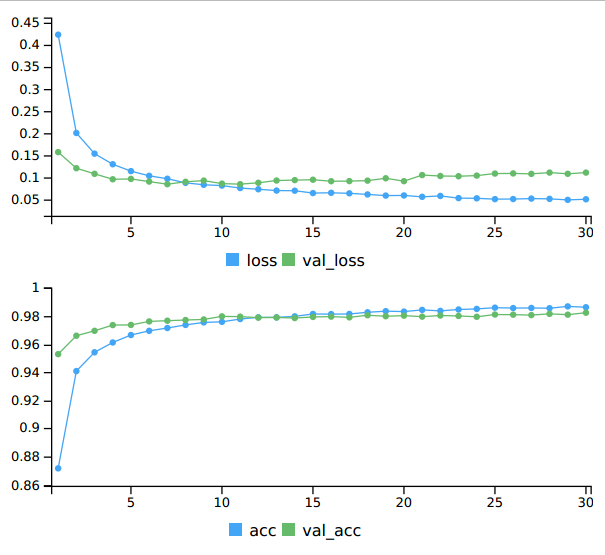

Introducción a la Computación con GPUs usando R 
==================================================================

# 1) Introducción

Las GPU (Graphics Processing Units; Unidades de Procesamiento de Gráficos) son unidades de procesamiento diseñadas originalmente para procesar gráficos en una computadora rápidamente. Esto se hace teniendo una gran cantidad de unidades de procesamiento simples para cálculos masivamente paralelos. La idea de la computación de propóstio general en GPU (GPGPU: general purpose GPU computing) es explotar esta capacidad para el cálculo general.

En este tutorial se revisará algunas formas de escribir cálculos implementados en la GPU. El contexto básico de la programación de la GPU es el "paralelismo de datos", en el que se realiza el mismo cálculo para muchos datos. Esto podría ser un cálculo matemático sobre millones de entradas en un vector o una simulación con muchas sub-simulaciones independientes. Algunos ejemplos de paralelismo de datos incluyen la multiplicación de matrices (haciendo la tarea de multiplicación en muchos elementos de matriz separados) o la integración numérica (haciendo una estimación numérica de la integral por partes en muchos intervalos/regiones), así como cálculos estadísticos estándar como estudios de simulación, bootstrapping, random forest, etc. Este tipo de cálculo también se conoce con el nombre "SIMD" (single instruction, multiple data; instrucción única, datos múltiples).


### 1.1) Hardware
Dos de los principales proveedores de dispositivos GPU son NVIDIA y AMD. *CUDA* es una plataforma para programar en GPUs, específicamente para GPUs NVIDIA, que permite enviar código C/C++/Fortran para su ejecución en la GPU. *OpenCL* es una alternativa que funciona con una variedad más amplia de GPUs. De estos dos, CUDA ha alcanzado mayor popularidad y últimamente está poniendo bastante énfasis en investigación, especialmente en torno a técnicas de deep learning y sus aplicaciones. Algunos ejemplos  [aqui](https://news.developer.nvidia.com/ai-helps-monitor-cancer-treatment/?ncid=--45239). 

Las GPUs tienen muchas unidades de procesamiento pero memoria algo limitada. Además, solo pueden usar datos en su propia memoria, no en la memoria de la CPU, por lo que los datos debe ser transferidos entre la CPU (el *host*) y la GPU (el *dispositivo*). Esta copia puede, en algunos cálculos, constituir una fracción muy grande del cálculo general. Por lo tanto, es mejor crear los datos y/o dejar los datos (para cálculos posteriores) en la GPU cuando sea posible y disminuir al máximo las transferencias.


### 1.2) Librerias de R que utilizan computación GPU

Estas son algunas de las librerías de R útiles para hacer cálculos en la GPU desde R, mismas que se encuentran recopiladas en la sección *Computación paralela: GPUs* de la Vista de Tarea [High Performance Computing](https://cran.r-project.org/web/views/HighPerformanceComputing.html). 

* gpuR: ofrece funciones habilitadas para GPU, nuevas clases gpu\* y vcl\* para envolver objetos típicos de R (ej: vector, matriz) que reflejan la sintaxis R típica sin la necesidad de conocer OpenCL.
* cudaBayesreg: paquete que implementa el rhierLinearModel del paquete bayesm utilizando el lenguaje y las herramientas CUDA de nVidia para proporcionar un análisis estadístico de alto rendimiento de voxels fMRI.
* tensorflow: proporciona acceso a la API completa de TensorFlow desde R que permite el cálculo numérico utilizando gráficos de flujo de datos. La arquitectura flexible permite a los usuarios implementar cálculos en una o más CPU o GPU en un pc, servidor o dispositivo móvil con una sola API.
* keras: interfaz hacia [keras](https://keras.io/), una API de redes neuronales de alto nivel, desarrolada para permitir experimentación rápida, con soporte para redes basadas en convolución (convolution based networks ) y redes recurrentes (recurrent networks), y se ejecuta transparentemente tanto en dispositivos CPU como GPU.


# 2) Hardware GPU disponible en CEDIA

El compute-0-12 tiene dos GPUs Tesla K40m

La sintaxis general para enviar un trabajo que requiere del uso del o de los GPU es la siguiente:

```
$ salloc --nodelist=compute-0-12 --exclusive /bin/bash
$ ssh compute-0-12
# Correr job
```

El parámetro `--exclusive` del comando `salloc` sólo deber ser utilizado si se quiere reservar todo el nodo, lo que implica bloquear el acceso a los demás usuarios. 


# 3) Uso básico del GPU

### 3.1) Obtener información sobre la GPU

Lo primero que se tiene que hacer antes de trabajar con una GPU, es obtener información acerca de la GPU y su actividad.


#### Especificaciones de Hardware

CUDA Toolkit ofrece ejemplos (samples) que sirven como referencia y proporcionan utilitarios básicos, como el utilitario *deviceQuery* que proporciona las características de la o las GPUs disponibles en un computador. En el compute-0-12, los ejemplos de CUDA están disponibles en: `/usr/local/cuda/samples/`

```
[usuario@compute-0-12 ~]$ cd /usr/local/cuda/samples/1_Utilities/deviceQuery
[usuario@compute-0-12 deviceQuery]$ ./deviceQuery
./deviceQuery Starting...

 CUDA Device Query (Runtime API) version (CUDART static linking)

Detected 2 CUDA Capable device(s)

Device 0: "Tesla K40m"
  CUDA Driver Version / Runtime Version          9.0 / 9.0
  CUDA Capability Major/Minor version number:    3.5
  Total amount of global memory:                 11440 MBytes (11995578368 bytes)
  (15) Multiprocessors, (192) CUDA Cores/MP:     2880 CUDA Cores
  GPU Max Clock rate:                            745 MHz (0.75 GHz)
  Memory Clock rate:                             3004 Mhz
  Memory Bus Width:                              384-bit
  L2 Cache Size:                                 1572864 bytes
  Maximum Texture Dimension Size (x,y,z)         1D=(65536), 2D=(65536, 65536), 3D=(4096, 4096, 4096)
  Maximum Layered 1D Texture Size, (num) layers  1D=(16384), 2048 layers
  Maximum Layered 2D Texture Size, (num) layers  2D=(16384, 16384), 2048 layers
  Total amount of constant memory:               65536 bytes
  Total amount of shared memory per block:       49152 bytes
  Total number of registers available per block: 65536
  Warp size:                                     32
  Maximum number of threads per multiprocessor:  2048
  Maximum number of threads per block:           1024
  Max dimension size of a thread block (x,y,z): (1024, 1024, 64)
  Max dimension size of a grid size    (x,y,z): (2147483647, 65535, 65535)
  Maximum memory pitch:                          2147483647 bytes
  Texture alignment:                             512 bytes
  Concurrent copy and kernel execution:          Yes with 2 copy engine(s)
  Run time limit on kernels:                     No
  Integrated GPU sharing Host Memory:            No
  Support host page-locked memory mapping:       Yes
  Alignment requirement for Surfaces:            Yes
  Device has ECC support:                        Enabled
  Device supports Unified Addressing (UVA):      Yes
  Supports Cooperative Kernel Launch:            No
  Supports MultiDevice Co-op Kernel Launch:      No
  Device PCI Domain ID / Bus ID / location ID:   0 / 27 / 0
  Compute Mode:
     < Default (multiple host threads can use ::cudaSetDevice() with device simultaneously) >

Device 1: "Tesla K40m"
  CUDA Driver Version / Runtime Version          9.0 / 9.0
  CUDA Capability Major/Minor version number:    3.5
  Total amount of global memory:                 11440 MBytes (11995578368 bytes)
  (15) Multiprocessors, (192) CUDA Cores/MP:     2880 CUDA Cores
  GPU Max Clock rate:                            745 MHz (0.75 GHz)
  Memory Clock rate:                             3004 Mhz
  Memory Bus Width:                              384-bit
  L2 Cache Size:                                 1572864 bytes
  Maximum Texture Dimension Size (x,y,z)         1D=(65536), 2D=(65536, 65536), 3D=(4096, 4096, 4096)
  Maximum Layered 1D Texture Size, (num) layers  1D=(16384), 2048 layers
  Maximum Layered 2D Texture Size, (num) layers  2D=(16384, 16384), 2048 layers
  Total amount of constant memory:               65536 bytes
  Total amount of shared memory per block:       49152 bytes
  Total number of registers available per block: 65536
  Warp size:                                     32
  Maximum number of threads per multiprocessor:  2048
  Maximum number of threads per block:           1024
  Max dimension size of a thread block (x,y,z): (1024, 1024, 64)
  Max dimension size of a grid size    (x,y,z): (2147483647, 65535, 65535)
  Maximum memory pitch:                          2147483647 bytes
  Texture alignment:                             512 bytes
  Concurrent copy and kernel execution:          Yes with 2 copy engine(s)
  Run time limit on kernels:                     No
  Integrated GPU sharing Host Memory:            No
  Support host page-locked memory mapping:       Yes
  Alignment requirement for Surfaces:            Yes
  Device has ECC support:                        Enabled
  Device supports Unified Addressing (UVA):      Yes
  Supports Cooperative Kernel Launch:            No
  Supports MultiDevice Co-op Kernel Launch:      No
  Device PCI Domain ID / Bus ID / location ID:   0 / 134 / 0
  Compute Mode:
     < Default (multiple host threads can use ::cudaSetDevice() with device simultaneously) >
> Peer access from Tesla K40m (GPU0) -> Tesla K40m (GPU1) : No
> Peer access from Tesla K40m (GPU1) -> Tesla K40m (GPU0) : No

deviceQuery, CUDA Driver = CUDART, CUDA Driver Version = 9.0, CUDA Runtime Version = 9.0, NumDevs = 2
Result = PASS
```

#### Observando el rendimiento en la GPU

El toolkit de NVIDIA provee un comando que permite ver información de uso del GPU de una forma análoga al comando *top* en la CPU. 

```
$ nvidia-smi -q -d UTILIZATION -l 1

Timestamp                           : Wed Jul  4 17:31:24 2018
Driver Version                      : 384.90

Attached GPUs                       : 2
GPU 00000000:1B:00.0
    Utilization
        Gpu                         : 0 %
        Memory                      : 0 %
        Encoder                     : 0 %
        Decoder                     : 0 %
    GPU Utilization Samples
        Duration                    : 18446744073709.21 sec
        Number of Samples           : 99
        Max                         : 0 %
        Min                         : 0 %
        Avg                         : 0 %
    Memory Utilization Samples
        Duration                    : 18446744073709.21 sec
        Number of Samples           : 99
        Max                         : 0 %
        Min                         : 0 %
        Avg                         : 0 %
    ENC Utilization Samples
        Duration                    : 18446744073709.21 sec
        Number of Samples           : 99
        Max                         : 0 %
        Min                         : 0 %
        Avg                         : 0 %
    DEC Utilization Samples
        Duration                    : 18446744073709.21 sec
        Number of Samples           : 99
        Max                         : 0 %
        Min                         : 0 %
        Avg                         : 0 %

GPU 00000000:86:00.0
    Utilization
        Gpu                         : 0 %
        Memory                      : 0 %
        Encoder                     : 0 %
        Decoder                     : 0 %
    GPU Utilization Samples
        Duration                    : 18446744073709.21 sec
        Number of Samples           : 99
        Max                         : 72 %
        Min                         : 0 %
        Avg                         : 0 %
    Memory Utilization Samples
        Duration                    : 18446744073709.21 sec
        Number of Samples           : 99
        Max                         : 3 %
        Min                         : 0 %
        Avg                         : 0 %
    ENC Utilization Samples
        Duration                    : 18446744073709.21 sec
        Number of Samples           : 99
        Max                         : 0 %
        Min                         : 0 %
        Avg                         : 0 %
    DEC Utilization Samples
        Duration                    : 18446744073709.21 sec
        Number of Samples           : 99
        Max                         : 0 %
        Min                         : 0 %
        Avg                         : 0 %

```

Para obtener mas información acerca de la utilización de la memoria:

```
$ nvidia-smi -q -d MEMORY -l 1

==============NVSMI LOG==============

Timestamp                           : Wed Jul  4 17:42:08 2018
Driver Version                      : 384.90

Attached GPUs                       : 2
GPU 00000000:1B:00.0
    FB Memory Usage
        Total                       : 11439 MiB
        Used                        : 0 MiB
        Free                        : 11439 MiB
    BAR1 Memory Usage
        Total                       : 16384 MiB
        Used                        : 2 MiB
        Free                        : 16382 MiB

GPU 00000000:86:00.0
    FB Memory Usage
        Total                       : 11439 MiB
        Used                        : 0 MiB
        Free                        : 11439 MiB
    BAR1 Memory Usage
        Total                       : 16384 MiB
        Used                        : 2 MiB
        Free                        : 16382 MiB
```


### 3.2) Descripción general de la computación en una GPU

La secuencia básica de operaciones para usar una GPU es:

* asignar memoria en la GPU
* transferir datos de la CPU a la GPU
* lanzar el kernel CUDA para operar en los hilos, con una configuración específica de bloque/grid
* (opcionalmente) ejecutar otro núcleo, que puede acceder a los datos almacenados en la GPU, incluidos los resultados del kernel anterior
* transferir los resultados de regreso a la CPU

Los cálculos clave se realizan en *kernel*s, que son funciones que codifican las operaciones de cómputo centrales que se ejecutan en paralelo. 

Como se indicó anteriormente, debemos pasar cualquier dato de la CPU a la GPU y hacer lo mismo a la inversa para obtener el resultado. También necesitaremos asignar memoria en la GPU. Sin embargo, en algunos casos, la transferencia y la asignación se realizarán automáticamente detrás de escena.


### 3.3) *Capacidad de cálculo* CUDA

La *capacidad de cálculo (compute capability)*  se refiere básicamente a la funcionalidad en evolución de la arquitectura NVIDIA. Los números más altos proporcionan más funcionalidad, pero solo se ejecutarán en hardware GPU más nuevo.

Dos ejemplos:

* Para usar dobles en lugar de flotantes, se necesita una capacidad de cálculo de al menos 1.3. 
* Para usar la librería de Deep Learning de CUDA (cuDNN: NVIDIA CUDA Deep Neural Network library), se necesita una capacidad de cálculo de al menos [3.0](https://docs.nvidia.com/deeplearning/sdk/cudnn-install/#prerequisites). 


# 4) Uso de librerías aceleradas por GPU 

La idea aquí es usar funcionalidad disponible en R, que oculte los detalles de la implementación de bajo nivel, confiando en la experiencia de otros para codificar de manera eficiente los cálculos estándar en la GPU.

Vale la pena mencionar que al ser librerías que funcionan sobre hardware "especial", estas librerías solo pueden ser instaladas si el equipo de cómputo dispone de dicho hardware, y de los requisitos de software asociados con el mismo. Para el caso de GPUs NVIDIA, como las que están disponibles en el nodo compute-0-12, estos requisitos de software son:

* *CUDA Toolkit*, que es la plataforma de computación paralela desarrollada por NVIDIA para computación general en unidades de procesamiento gráfico (GPU). 
* *Controladores de GPU*, que normalmente se instala en conjunto con el Toolkit.


### 4.1) Operaciones de álgebra lineal

Comenzaremos con un uso de alto nivel de la GPU simplemente llamando a rutinas de álgebra lineal que usen la GPU. Dada la naturaleza numérica de la mayoría de las aplicaciones R, es natural que existan paquetes desarrollados como interfaz entre R y GPU. Varios paquetes R ocultan los detalles de la implementación de la GPU y permiten realizar operaciones vectoriales y matriciales, incluido el álgebra lineal, utilizando código R estándar. En algunos casos, sobrecargan las funciones R habituales de modo que simplemente puede llamar a una función del mismo nombre que en la base R.

Algunos paquetes en este contexto incluyen: *gpuR*, *gmatrix*, *gputools*. Desafortunadamente, de estas 3 librerías, únicamente *gpuR* está disponible para la versión más reciente de R, 3.5, liberada en abril de 2018. 

*gpuR* proporciona funciones habilitadas para GPU para objetos R de una manera simple y accesible. Para acceder a estas funciones se proporcionan nuevas clases gpu\* y vcl\* para envolver objetos R típicos (eg: vector, matriz), tanto en el host como en los espacios del dispositivo, para reflejar la sintaxis R típica sin la necesidad de conocer *OpenCL*. 

A continuación, se hace una prueba simple en la que se compara el rendimiento de la multiplicación de matrices sobre CPU versus GPU. 

```{r, eval=FALSE}
library(gpuR)
library(ggplot2)
library(profvis)

orders <- seq(1000,3000,by=1000)
#orders <- seq(1000,1600,by=200)
t1 <- t2 <- sizes <- c()

for(order in orders) {
  print(order)
  A = matrix(rnorm(order^2), nrow=order) 
  sizes <- c( sizes, format(object.size(A), units="auto") )
  gpuA = gpuMatrix(A, type="float")

  elapsed1 <- system.time({C = A %*% A})[3]  # Operacion regular (ejecutada en la CPU) 
  elapsed2 <- system.time({gpuC = gpuA %*% gpuA})[3] # Operacion acelerada (ejecutada en la GPU)

  t1 = c(t1, elapsed1)
  t2 = c(t2, elapsed2)
  
  rm(A,C,gpuA,gpuC)
  gc()
}

# Armar un dataframe con los resultados de las pruebas del for anterior
df = data.frame(order = rep(orders,2), 
                label = rep(paste0(orders," (", sizes, ")"), 2),
                mode = rep(c("cpu","gpu"),each=4), 
                elapsed = c(t1,t2))

# Guardar el dataframe (ya que el codigo de este chunk para plotearlo a continuación)
# saveRDS(df, file = "data/gpuMm.rds")
```

```{r}
library(ggplot2)
df <- readRDS(file = "data/gpuMm.rds")
ggplot(df, aes(x=label, y=elapsed, fill=mode)) +
  geom_bar(stat="identity", position=position_dodge()) +
  xlab("Orden (Mem)") + 
  ylab("Tiempo de ejecucion (seg)") #+ scale_y_log10() 

```


### 4.2) (Algo intermedio)


### 4.3) Ejemplo clásico de reconocimiento de imágenes MNIST
La base de datos MNIST (Modified National Institute of Standards and Technology database; Base de datos modificada del Instituto Nacional de Estándares y Tecnología), es una gran base de datos de dígitos manuscritos que se usa comúnmente para entrenar sistemas de procesamiento de imágenes. La base de datos también se usa ampliamente para entrenamiento y pruebas en el campo del aprendizaje automático (machine learning).


A continuación se incluye el fragmento de un script que haciendo uso de las librerías [*keras*](https://keras.rstudio.com/) y [*tensorflow*](https://www.tensorflow.org/), entrena un modelo de clasificación de imágenes, que hace uso de las capacidades de la GPU. Hay que mencionar que estas librerías funcionan tanto sobre CPUs como GPUs. Para hacer uso de tensorflow con capacidades GPU, fue necesario instalar la librería NVIDIA CUDA Deep Neural Network ([cuDNN](https://developer.nvidia.com/cudnn)). 


```{r, eval=FALSE}
library(keras)
use_condaenv("keras")
# install_keras(tensorflow="gpu") # Instalar solo la primera vez

# Preparando los datos
mnist <- dataset_mnist()
x_train <- mnist$train$x
y_train <- mnist$train$y
x_test <- mnist$test$x
y_test <- mnist$test$y

# Re-organizar
x_train <- array_reshape(x_train, c(nrow(x_train), 784))
x_test <- array_reshape(x_test, c(nrow(x_test), 784))
# Re-escalar
x_train <- x_train / 255
x_test <- x_test / 255


y_train <- to_categorical(y_train, 10)
y_test <- to_categorical(y_test, 10)

# Definir el modelo
model <- keras_model_sequential()
model %>%
  layer_dense(units = 256, activation = 'relu', input_shape = c(784)) %>%
  layer_dropout(rate = 0.4) %>%
  layer_dense(units = 128, activation = 'relu') %>%
  layer_dropout(rate = 0.3) %>%
  layer_dense(units = 10, activation = 'softmax')

summary(model)

model %>% compile(
  loss = 'categorical_crossentropy',
  optimizer = optimizer_rmsprop(),
  metrics = c('accuracy')
)

# Entrenar el modelo
history <- model %>% fit(
  x_train, y_train,
  epochs = 30, batch_size = 128,
  validation_split = 0.2
)

# Evaluar el modelo
model %>% evaluate(x_test, y_test)

# Predecir en datos nuevos
model %>% predict_classes(x_test)

```

A continuacion se incluye parte relevante de la salida de los comandos anteriores:
```
2018-07-07 14:20:40.077703: I tensorflow/core/common_runtime/gpu/gpu_device.cc:1356] Found device 0 with properties: 
name: Quadro K1100M major: 3 minor: 0 memoryClockRate(GHz): 0.7055
pciBusID: 0000:01:00.0
totalMemory: 1.95GiB freeMemory: 1.63GiB
2018-07-07 14:20:40.077730: I tensorflow/core/common_runtime/gpu/gpu_device.cc:1406] Ignoring visible gpu device (device: 0, name: Quadro K1100M, pci bus id: 0000:01:00.0, compute capability: 3.0) with Cuda compute capability 3.0. The minimum required Cuda capability is 3.5.
2018-07-07 14:20:40.077740: I tensorflow/core/common_runtime/gpu/gpu_device.cc:923] Device interconnect StreamExecutor with strength 1 edge matrix:
2018-07-07 14:20:40.077745: I tensorflow/core/common_runtime/gpu/gpu_device.cc:929]      0 
2018-07-07 14:20:40.077749: I tensorflow/core/common_runtime/gpu/gpu_device.cc:942] 0:   N 
Train on 48000 samples, validate on 12000 samples
Epoch 1/30
48000/48000 [==============================] - 2s 48us/step - loss: 0.4254 - acc: 0.8707 - val_loss: 0.1649 - val_acc: 0.9525
Epoch 2/30
48000/48000 [==============================] - 2s 46us/step - loss: 0.2029 - acc: 0.9388 - val_loss: 0.1247 - val_acc: 0.9640
Epoch 3/30
48000/48000 [==============================] - 2s 45us/step - loss: 0.1595 - acc: 0.9529 - val_loss: 0.1097 - val_acc: 0.9680
Epoch 4/30
48000/48000 [==============================] - 2s 46us/step - loss: 0.1312 - acc: 0.9613 - val_loss: 0.1035 - val_acc: 0.9712
Epoch 5/30
48000/48000 [==============================] - 2s 45us/step - loss: 0.1158 - acc: 0.9663 - val_loss: 0.0977 - val_acc: 0.9729
Epoch 6/30
48000/48000 [==============================] - 2s 46us/step - loss: 0.1070 - acc: 0.9685 - val_loss: 0.0968 - val_acc: 0.9750
Epoch 7/30
48000/48000 [==============================] - 2s 47us/step - loss: 0.1003 - acc: 0.9714 - val_loss: 0.1028 - val_acc: 0.9728
Epoch 8/30
48000/48000 [==============================] - 2s 48us/step - loss: 0.0922 - acc: 0.9734 - val_loss: 0.0931 - val_acc: 0.9762
Epoch 9/30
48000/48000 [==============================] - 2s 47us/step - loss: 0.0869 - acc: 0.9750 - val_loss: 0.0921 - val_acc: 0.9775
Epoch 10/30
48000/48000 [==============================] - 2s 46us/step - loss: 0.0812 - acc: 0.9762 - val_loss: 0.0991 - val_acc: 0.9752
Epoch 11/30
48000/48000 [==============================] - 2s 46us/step - loss: 0.0803 - acc: 0.9771 - val_loss: 0.0972 - val_acc: 0.9767
Epoch 12/30
48000/48000 [==============================] - 2s 47us/step - loss: 0.0739 - acc: 0.9782 - val_loss: 0.0993 - val_acc: 0.9773
Epoch 13/30
48000/48000 [==============================] - 2s 46us/step - loss: 0.0729 - acc: 0.9785 - val_loss: 0.0883 - val_acc: 0.9798
Epoch 14/30
48000/48000 [==============================] - 2s 46us/step - loss: 0.0728 - acc: 0.9794 - val_loss: 0.0952 - val_acc: 0.9793
Epoch 15/30
48000/48000 [==============================] - 2s 49us/step - loss: 0.0688 - acc: 0.9810 - val_loss: 0.0961 - val_acc: 0.9794
Epoch 16/30
48000/48000 [==============================] - 2s 47us/step - loss: 0.0665 - acc: 0.9811 - val_loss: 0.0963 - val_acc: 0.9782
Epoch 17/30
48000/48000 [==============================] - 2s 46us/step - loss: 0.0631 - acc: 0.9821 - val_loss: 0.0979 - val_acc: 0.9794
Epoch 18/30
48000/48000 [==============================] - 2s 47us/step - loss: 0.0613 - acc: 0.9832 - val_loss: 0.0994 - val_acc: 0.9781
Epoch 19/30
48000/48000 [==============================] - 2s 47us/step - loss: 0.0617 - acc: 0.9832 - val_loss: 0.0989 - val_acc: 0.9797
Epoch 20/30
48000/48000 [==============================] - 2s 46us/step - loss: 0.0605 - acc: 0.9839 - val_loss: 0.1024 - val_acc: 0.9794
Epoch 21/30
48000/48000 [==============================] - 2s 45us/step - loss: 0.0601 - acc: 0.9831 - val_loss: 0.1014 - val_acc: 0.9793
Epoch 22/30
48000/48000 [==============================] - 2s 45us/step - loss: 0.0583 - acc: 0.9843 - val_loss: 0.0993 - val_acc: 0.9798
Epoch 23/30
48000/48000 [==============================] - 2s 45us/step - loss: 0.0572 - acc: 0.9845 - val_loss: 0.1028 - val_acc: 0.9787
Epoch 24/30
48000/48000 [==============================] - 2s 46us/step - loss: 0.0554 - acc: 0.9852 - val_loss: 0.1001 - val_acc: 0.9788
Epoch 25/30
48000/48000 [==============================] - 2s 45us/step - loss: 0.0525 - acc: 0.9856 - val_loss: 0.1077 - val_acc: 0.9797
Epoch 26/30
48000/48000 [==============================] - 2s 45us/step - loss: 0.0569 - acc: 0.9847 - val_loss: 0.1109 - val_acc: 0.9785
Epoch 27/30
48000/48000 [==============================] - 2s 45us/step - loss: 0.0555 - acc: 0.9854 - val_loss: 0.1078 - val_acc: 0.9787
Epoch 28/30
48000/48000 [==============================] - 2s 45us/step - loss: 0.0507 - acc: 0.9866 - val_loss: 0.1102 - val_acc: 0.9798
Epoch 29/30
48000/48000 [==============================] - 2s 45us/step - loss: 0.0513 - acc: 0.9863 - val_loss: 0.1205 - val_acc: 0.9785
Epoch 30/30
48000/48000 [==============================] - 2s 45us/step - loss: 0.0539 - acc: 0.9854 - val_loss: 0.1169 - val_acc: 0.9789
10000/10000 [==============================] - 0s 25us/step

```

Mientras se entrena el modelo, se visualiza como varian las metrica de perdida y precision (loss and accuracy metrics) en los datasets de test y validacion:




# 5) Comentarios finales

### 5.1) Algunos pensamientos sobre la mejora de la velocidad computacional

[Suchard et al (2010)](http://www.tandfonline.com/doi/abs/10.1198/jcgs.2010.10016#.U2GTuBUgoWk) y  [Lee et al (2010)](http://www.tandfonline.com/doi/abs/10.1198/jcgs.2010.10039#.U2GT9BUgoWk) hablan sobre el uso de GPU en estadística. Las aceleraciones que reportan llegan a 120 y 500 veces la velocidad de un único núcleo de CPU, respectivamente. Algunas de las razones por las cuales estas aceleraciones son tan impresionantes son:

* Uso de cálculos de precisión simple (single precision floating point calculations). Si la precisión no afecta sustancialmente el cálculo, vale la pena intentarlo. 

* Tareas computacionales que son muy intensas en términos aritméticos pero con acceso limitado a la memoria (ver el artículo de Lee et al.)

* Garantizar que los hilos numerados contundentemente accedan a las ubicaciones de memoria contiguas. Más información [aquí](https://docs.nvidia.com/cuda/cuda-c-best-practices-guide/index.html#coalesced-access-to-global-memory).

* Uso cuidadoso de la memoria compartida (compartida entre los hilos en un bloque) en lugar de la memoria principal de la GPU (ver el documento de Suchard et al.); en particular, esto puede evitar el acceso a la memoria no contigua.

* Evitar declaraciones condicionales y sincronización/barreras, ya que los hilos operan en bloqueo-paso en grupos de 32 hilos (un 'warp')

Por lo tanto, para algunas tareas y probablemente con un esfuerzo adicional de codificación, se puede conseguir aceleraciones de 100-200 veces en comparación con un solo núcleo de CPU.


## 6) Algunas referencias
- Este tutorial está basado en el workshop [GPU computation for statistics](https://github.com/berkeley-scf/gpu-workshop-2016) dictado por la Universidad de Berkeley.
- El libro Parallel Computing for Data Science por Norman Matloff tiene un material introductorio útil.
- El [sitio web de NVIDIA](http://devblogs.nvidia.com/parallelforall/) tiene un montón de publicaciones útiles en el blog.
- [Suchard et al (2010)](http://www.tandfonline.com/doi/abs/10.1198/jcgs.2010.10016#.U2GTuBUgoWk)
- [Lee et al (2010](http://www.tandfonline.com/doi/abs/10.1198/jcgs.2010.10039#.U2GT9BUgoWk)

